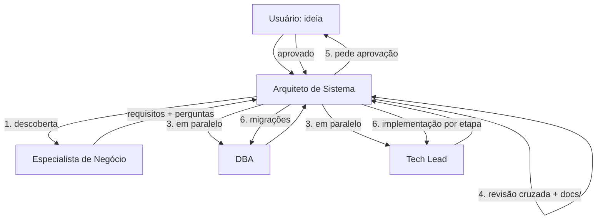

# Guia de Agentes no Claude Code

Este guia explica como **criar**, **usar** e **atualizar** agentes (subagents) no Claude Code. Ele usa como exemplo o time já criado: Arquiteto de Sistema, Especialista de Negócio, DBA e Tech Lead.

---

## 1. O que é um agente

Um agente é um arquivo `.md` com duas partes:

1. **Frontmatter** (entre `---`): nome, descrição, ferramentas e modelo.
2. **Corpo**: o *system prompt*, ou seja, as instruções de quem o agente é e como ele trabalha.

Cada agente roda com **contexto próprio**: ele não enxerga a conversa principal. Só recebe o prompt que quem o chamou enviar.

---

## 2. Onde os agentes ficam

| Local | Escopo | Quando usar |
|---|---|---|
| `~/.claude/agents/` | **Usuário**: vale para todos os projetos | Time padrão que você reusa em qualquer projeto |
| `<projeto>/.claude/agents/` | **Projeto**: só naquele repositório, e pode ir para o git | Agentes específicos do projeto ou compartilhados com o time |

> Se existirem dois agentes com o **mesmo `name`**, o do **projeto** tem prioridade sobre o do usuário.

O nosso time está em `~/.claude/agents/`:

```
~/.claude/agents/
├── arquiteto-de-sistema.md   ← orquestrador
├── especialista-negocio.md
├── dba.md
└── techlead.md
```

---

## 3. Como criar um agente

### Opção A: pelo comando `/agents` (interativo)

Dentro do Claude Code, digite `/agents`, escolha **Create new agent**, selecione o escopo (usuário ou projeto) e siga os passos. Dá até para pedir que o Claude gere o prompt para você.

### Opção B: criando o arquivo manualmente

Crie `~/.claude/agents/<nome>.md` (ou `.claude/agents/<nome>.md` no projeto):

```markdown
---
name: qa
description: Especialista em QA. Use para escrever planos de teste, testes e2e e revisar critérios de aceite. Chamado pelo arquiteto-de-sistema.
tools: Read, Write, Edit, Glob, Grep, Bash
model: sonnet
---

Você é o **QA** do time. Quem chama você é o Arquiteto de Sistema.

## Sua responsabilidade
...

## O que entregar
1. ...
2. ...

## Regras
- Responda em português do Brasil.
```

### Campos do frontmatter

| Campo | Obrigatório | Para que serve |
|---|---|---|
| `name` | ✅ | Identificador único, em minúsculas e com hífen (`techlead`, `dba`). É esse nome que o orquestrador usa para chamar o agente. |
| `description` | ✅ | **Quando** usar o agente. O Claude decide se delega ou não lendo este texto, então seja específico. |
| `tools` | ❌ | Ferramentas liberadas. Se você omitir, o agente herda todas. Restrinja ao necessário (ex.: o Especialista de Negócio não precisa de `Write`). |
| `model` | ❌ | `opus`, `sonnet`, `haiku` ou `inherit`. Use `opus` para quem decide (Arquiteto) e `sonnet` para quem executa. |

### Ferramenta especial do orquestrador: `Agent(...)`

Para um agente poder chamar outros, inclua `Agent` nas `tools`, limitando a quem ele pode chamar:

```yaml
tools: Agent(especialista-negocio, dba, techlead), Read, Write, Edit, Glob, Grep, Bash
```

---

## 4. Regras do nosso time

### 4.1 Regras de orquestração

1. **O Arquiteto de Sistema é o único orquestrador.** Ele recebe a demanda e chama os responsáveis.
2. **Um subagente não chama outro subagente.** Essa é uma limitação do Claude Code. Por isso o Arquiteto precisa rodar como **agente principal da sessão** (veja a seção 5).
3. **Os subagentes não veem a conversa.** Todo pedido do Arquiteto precisa ser autocontido: contexto, decisões já tomadas, o que se espera de volta e em que formato.
4. **Tarefas independentes rodam em paralelo** (ex.: DBA e Tech Lead ao mesmo tempo). Tarefas que dependem de outras rodam em sequência.
5. **Nada é implementado sem a aprovação do usuário.**

### 4.2 Fluxo padrão



### 4.3 Responsabilidades (quem faz o quê)

| Agente | Faz | **Não** faz |
|---|---|---|
| Arquiteto de Sistema | Arquitetura, ADRs, coordenação, conflitos, documentação final | O trabalho detalhado dos especialistas |
| Especialista de Negócio | Requisitos (RF/RNF), regras (RN), personas, MVP, critérios de aceite | Escolher tecnologia ou banco |
| DBA | Banco, diagrama ER, schema, índices, migrações, LGPD | Alterar código da aplicação |
| Tech Lead | Stack, estrutura, padrões, plano em etapas, implementação e testes | Mudar o schema sem passar pelo DBA/Arquiteto |

### 4.4 Documentação gerada no projeto

```
docs/
├── 01-negocio.md        ← Especialista de Negócio
├── 02-arquitetura.md    ← Arquiteto (com ADRs)
├── 03-dados.md          ← DBA
└── 04-plano-tecnico.md  ← Tech Lead
```

---

## 5. Como usar em um projeto

### 5.1 Iniciar um projeto novo com o time

```bash
mkdir meu-projeto && cd meu-projeto
git init
claude --agent arquiteto-de-sistema
```

Depois é só descrever a ideia:

> Quero um sistema de agendamento para clínicas, com cadastro de pacientes e lembretes por WhatsApp.

### 5.2 Deixar o Arquiteto como padrão no projeto

Assim você não precisa digitar `--agent` toda vez. Crie `meu-projeto/.claude/settings.json`:

```json
{
  "agent": "arquiteto-de-sistema"
}
```

A partir daí, basta rodar `claude` dentro da pasta.

### 5.3 Chamar um agente específico diretamente

Na sessão, você pode pedir explicitamente:

> Use o agente **dba** para revisar os índices da tabela `agendamentos`.

Ou mencionar o agente com `@`, por exemplo `@dba`.

### 5.4 Conferir os agentes disponíveis

Dentro do Claude Code, digite `/agents` para listar, ver, editar ou excluir agentes.

---

## 6. Como atualizar os agentes

### 6.1 Editar um agente existente

- **Pelo Claude Code:** `/agents`, escolha o agente e depois **Edit**.
- **Manualmente:** abra o arquivo e edite:
  ```bash
  code ~/.claude/agents/techlead.md
  ```
- **Pedindo ao Claude:**
  > Atualize o agente techlead em ~/.claude/agents/techlead.md para usar sempre Next.js + Prisma + PostgreSQL.

> ⚠️ Se a sessão já estava aberta quando você editou o arquivo, pode ser preciso **reiniciar o `claude`** para as mudanças valerem.

### 6.2 Adicionar um novo agente ao time

1. Crie o arquivo do novo agente (ex.: `qa.md`), como mostrado na seção 3.
2. **Registre o agente no orquestrador**, senão o Arquiteto não consegue chamá-lo. Edite `arquiteto-de-sistema.md`:
   - no frontmatter, acrescente o nome em `Agent(...)`:
     ```yaml
     tools: Agent(especialista-negocio, dba, techlead, qa), Read, Write, ...
     ```
   - na tabela "Quando chamar", adicione uma linha para o novo agente;
   - no "Fluxo padrão", indique em qual passo ele entra.
3. Reinicie o `claude` e confira com `/agents`.

### 6.3 Personalizar um agente só para um projeto

Copie o agente do usuário para dentro do projeto e edite a cópia. A versão do projeto passa a ter prioridade:

```bash
mkdir -p .claude/agents
cp ~/.claude/agents/techlead.md .claude/agents/techlead.md
```

Isso é útil quando um projeto usa uma stack diferente do padrão.

### 6.4 Remover um agente

```bash
rm ~/.claude/agents/<nome>.md
```

Se ele era chamado pelo Arquiteto, **remova também** o nome de `Agent(...)` e da tabela no `arquiteto-de-sistema.md`.

### 6.5 Versionar os agentes (recomendado)

Guarde os agentes do usuário em um repositório git para ter histórico e poder voltar versões:

```bash
cd ~/.claude/agents
git init && git add . && git commit -m "time de agentes v1"
```

---

## 7. Boas práticas

- **`description` clara e específica.** É ela que define quando o agente é chamado.
- **Um agente, uma responsabilidade.** Se um agente faz tudo, ele perde o propósito.
- **Formato de saída definido** (títulos numerados). Isso facilita o trabalho do orquestrador ao consolidar as respostas.
- **Menor conjunto de `tools` possível.** Um agente que só analisa não precisa de `Write` nem de `Bash`.
- **Suposições marcadas** (`[SUPOSIÇÃO]`, `[PERGUNTA]`), para o usuário validar.
- **Teste depois de editar:** rode uma demanda pequena e veja se o agente se comporta como esperado.

---

## 8. Problemas comuns

| Problema | Causa provável | Solução |
|---|---|---|
| O Arquiteto não chama os outros agentes | A sessão foi aberta com `claude` puro, e não com `--agent` | Use `claude --agent arquiteto-de-sistema` ou configure `"agent"` no `settings.json` |
| O agente não aparece em `/agents` | Frontmatter inválido ou arquivo fora da pasta certa | Confira os `---`, o `name` e o `description` e se o arquivo está em `agents/` |
| A mudança no agente não surtiu efeito | A sessão já estava aberta | Reinicie o `claude` |
| O novo agente nunca é chamado | Não foi adicionado em `Agent(...)` no Arquiteto | Siga a seção 6.2 |
| O subagente "não sabe" o que foi decidido | Os subagentes não veem a conversa | O prompt de delegação precisa levar todo o contexto |
